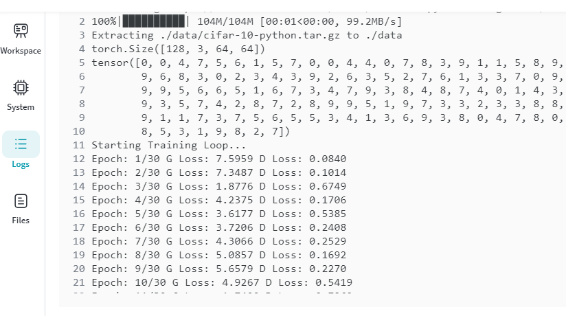
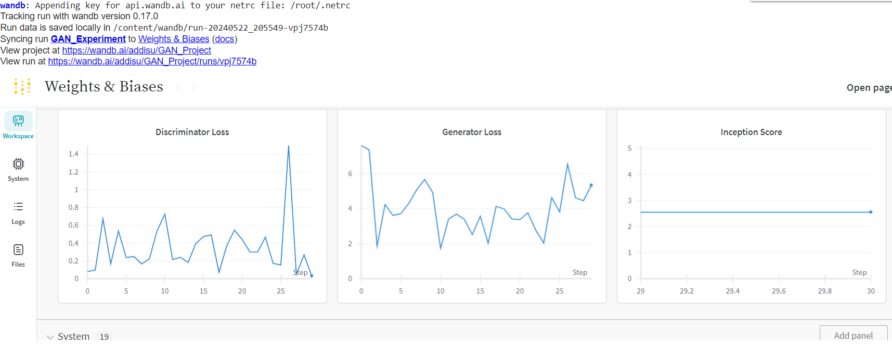

# deep_learning_project

# GAN Loss Visualization

This repository contains visualizations of the loss curves for a Generative Adversarial Network (GAN) model. The images provided are:

1. `descriminator_and_generator_loss.PNG`
2. `image_by_gan.PNG`
3. `wandb.PNG`

## 1. `descriminator_and_generator_loss.PNG`

This image shows the loss curves for both the discriminator and generator during the training process of the GAN model. The x-axis represents the training steps, while the y-axis shows the loss values. The blue line represents the discriminator loss, and the orange line represents the generator loss.

The loss curves provide insights into the training progress and the balance between the discriminator and generator. Ideally, the discriminator and generator losses should converge to a stable point, indicating that the model has reached an equilibrium.

## 2. `image_by_gan.PNG`

This image displays a sample output generated by the trained GAN model. GANs are capable of generating realistic images by learning the underlying distribution of the training data. The generated image showcases the model's ability to create new, plausible samples.

## 3. `wandb.PNG`

This image is likely a screenshot from Weights & Biases (WandB), a popular platform for tracking and visualizing machine learning experiments. WandB provides various features, such as logging metrics, visualizing loss curves, and comparing different runs.

The `wandb.PNG` image may include additional information, such as the experiment configuration, hyperparameters, or other relevant metrics tracked during the GAN training process.

These visualizations can be helpful for monitoring the training progress, evaluating the model's performance, and comparing different GAN architectures or training strategies.
