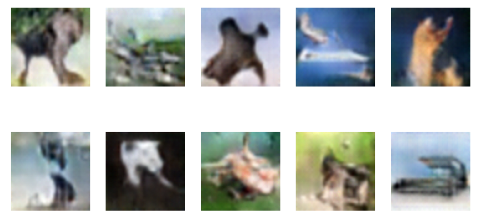

# Project Title: Investigating Diffusion Models' Superiority in Image Synthesis over GANs

## Description
This project aims to explore and compare diffusion models with Generative Adversarial Networks (GANs) in the context of image synthesis. The goal is to investigate the potential advantages of diffusion models over GANs in generating high-quality images.

## Installation

```bash
pip install wandb
```
## Usage
To run the experiment, follow these steps:
1. Install the required packages:
```python
import sys
import torch
import warnings
import torchvision
import numpy as np
import torch.nn as nn
import torch.utils.data
import torch.optim as optim
import torchvision.utils as vutils
import torchvision.transforms as transforms

from scipy.stats import entropy
from torch.autograd import Variable
from torch.nn import functional as F
from matplotlib import pyplot as plt
from torch.utils.data import DataLoader
from torchvision.models.inception import inception_v3

warnings.filterwarnings('ignore')
np.set_printoptions(threshold=sys.maxsize)

```
# data_set


## Output

### GAN Loss Visualization
This section includes visualizations of the loss curves for a Generative Adversarial Network (GAN) model. The provided images are:

### 1. `descriminator_and_generator_loss.PNG`

- Illustrates the loss progression of the discriminator and generator during GAN training.

### 2. `image_by_gan.PNG`
Image Generated by GAN:
- Displays a sample output generated by the trained GAN model, showcasing its ability to create realistic images.

### 3. `wandb.PNG`
Weights & Biases Visualization

- A screenshot from Weights & Biases (WandB) captured during the experiment.
  ### 4  new Result_from_low _inception_score_note_book
  
## diffusion_model_out_put
_sample_image.png)


## Contributing
Contributions via pull requests are welcome. Feel free to reach out to the project maintainers for more information.

## License
Refer to the project's license file for details on the licensing of code and resources.

## Contact
For inquiries or feedback, contact via email at 0941813057estifanos@gmail.com.
## our team


## Reference :(https://pytorch.org/tutorials/beginner/dcgan_faces_tutorial.html)


